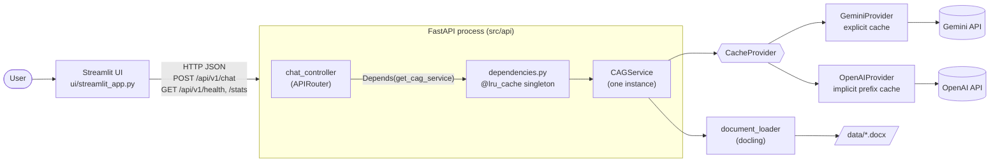
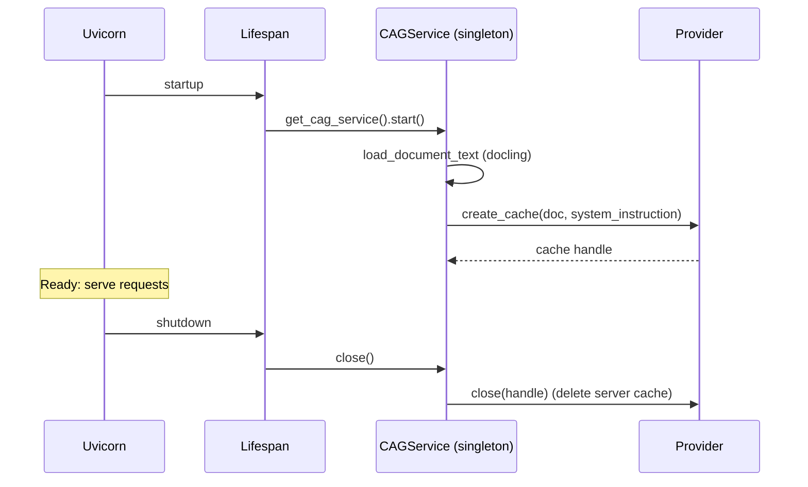
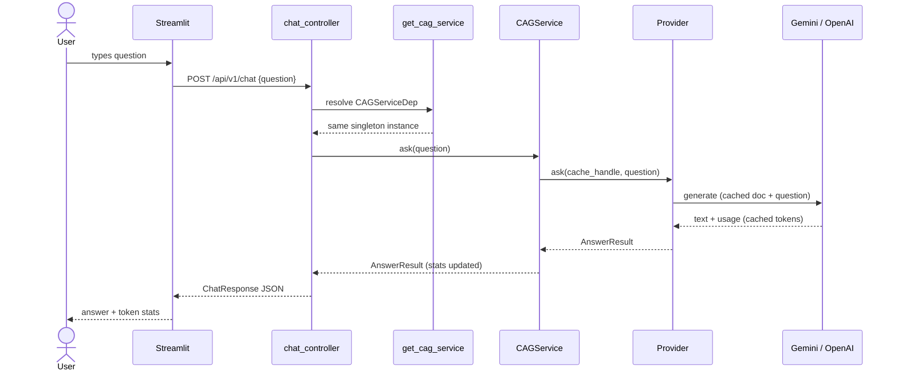

# Architecture — CAG HR Policy Assistant

This document describes how the Cache-Augmented Generation (CAG) pipeline is
packaged as a **FastAPI backend** with a **Streamlit frontend**, how the
pipeline is shared across requests as a **singleton dependency**, and how to
run and use it.

For background on *why* caching works at the model level, see
[`KV_CACHE.md`](KV_CACHE.md).

---

## 1. High-level view



There are three processes/boundaries:

| Tier | Tech | Responsibility |
|---|---|---|
| Presentation | Streamlit | Chat UI, per-answer token stats, session totals. No LLM code. |
| Application | FastAPI + Uvicorn | HTTP contract, validation, error mapping, lifecycle of the pipeline. |
| Pipeline / domain | `CAGService` + providers | Load doc once → build cache once → answer many questions. |

The UI and API are separate processes and communicate only over HTTP. That
means you could replace Streamlit with any other client (React, curl, Slack
bot) without changing the backend, or scale the two tiers independently.

---

## 2. Project layout

```
CAG/
├── main.py                         # Entry: starts Uvicorn (or --ask one-shot CLI)
├── src/
│   ├── core/
│   │   ├── config.py               # Settings dataclass; .env → provider selection
│   │   └── document_loader.py      # docling: .docx → markdown text
│   ├── providers/
│   │   ├── __init__.py             # build_provider(settings) factory
│   │   ├── base.py                 # CacheProvider ABC + AnswerResult
│   │   ├── gemini_provider.py      # explicit server-side cache (client.caches)
│   │   └── openai_provider.py      # implicit prompt-prefix caching
│   ├── services/
│   │   └── cag_service.py          # CAGService: start / ask / stats / close
│   └── api/
│       ├── app.py                  # create_app(), lifespan (warm-up + teardown)
│       ├── dependencies.py         # get_settings / get_cag_service singletons
│       ├── schemas.py              # Pydantic request/response models
│       └── controllers/
│           └── chat_controller.py  # /api/v1/health, /chat, /stats
├── ui/
│   └── streamlit_app.py            # Streamlit chat client
├── tests/
│   └── test_api.py                 # API tests with a fake provider (no keys needed)
├── data/HR_Leave_Policy_and_Encashment_Guidelines.docx
└── docs/ARCHITECTURE.md, KV_CACHE.md
```

### Layering rules

Dependencies point **inward only**:

```
ui  ──HTTP──▶  api  ──▶  services  ──▶  providers  ──▶  core
```

- `core` knows nothing about the other layers.
- `providers` depend on `core.config` only (for the factory).
- `services` orchestrate `core` + `providers`; they know nothing about HTTP.
- `api` translates HTTP ↔ service calls; it never talks to an SDK directly.
- `ui` knows only the HTTP contract.

---

## 3. Components

### 3.1 `core.config` — Settings

`load_settings()` reads `.env` and returns an immutable `Settings`:

| Env var | Purpose | Default |
|---|---|---|
| `LLM_PROVIDER` | Force `gemini` or `openai` | auto-detect |
| `GEMINI_API_KEY` / `OPENAI_API_KEY` | Credentials; Gemini wins if both set and not forced | — |
| `GEMINI_MODEL` / `OPENAI_MODEL` | Model name | `gemini-3.6-flash` / `gpt-4o-mini` |
| `DOCUMENT_PATH` | Source document | `data/HR_Leave_Policy_and_Encashment_Guidelines.docx` |
| `API_BASE_URL` | (UI only) where Streamlit finds the API | `http://localhost:8000` |

### 3.2 `providers` — Strategy pattern

`CacheProvider` is the strategy interface:

```python
create_cache(document_text, system_instruction) -> handle
ask(handle, question) -> AnswerResult
cache_mode(handle) -> str        # "explicit" | "implicit" | "fallback (no cache)"
close(handle) -> None
```

- **GeminiProvider** creates a server-side `CachedContent` (TTL 1h) and passes
  `cached_content=<name>` on each call. If caching is unavailable (free tier,
  doc too small) it logs a warning and falls back to inlining the document.
- **OpenAIProvider** has no cache object: it builds a fixed system-prompt
  prefix containing the document so OpenAI's automatic prefix cache hits on
  every call after the first.

`build_provider(settings)` is a factory that picks the implementation and
lazily imports only the active SDK.

### 3.3 `services.CAGService` — the pipeline

| Method | What it does | Cost |
|---|---|---|
| `start()` | docling parse → `provider.create_cache()` | Expensive, **once** |
| `ask(q)` | `provider.ask(handle, q)`, accumulate stats | Cheap, per request |
| `stats()` | Snapshot of `SessionStats` | — |
| `close()` | `provider.close(handle)` (deletes Gemini cache) | Once, on shutdown |

It is thread-safe: `start()`/`close()` and stats updates are guarded by a
`threading.Lock`. The LLM call itself runs outside the lock, so concurrent
requests are not serialized.

The provider is injectable via the constructor
(`CAGService(settings, provider=...)`), which is how tests swap in a fake.

### 3.4 `api.dependencies` — Singleton dependency

```python
@lru_cache(maxsize=1)
def get_cag_service() -> CAGService:
    return CAGService(get_settings())

CAGServiceDep = Annotated[CAGService, Depends(get_cag_service)]
```

- `lru_cache` on a zero-arg function = **process-wide singleton**. The first
  call constructs the service, and every later call returns the same object.
- Controllers declare `service: CAGServiceDep` and FastAPI resolves it per
  request, always to that same instance.
- Why a singleton: the document parse and cache creation are expensive, and
  the cache handle (for example a Gemini `CachedContent` name) must be reused
  across requests. That reuse is the whole point of CAG. A per-request
  instance would rebuild the cache on every call and defeat it.
- Tests override it with
  `app.dependency_overrides[get_cag_service] = lambda: fake_service`.

### 3.5 `api.app` — Lifespan



The warm-up at startup means the first user request doesn't pay the
parse-and-cache cost. The server only reports "startup complete" once the
cache is ready.

### 3.6 `api.controllers.chat_controller` — Controller

Handlers are sync `def`, because the provider SDK calls are blocking. FastAPI runs them in its
threadpool so the event loop stays free.

| Method & path | Request | Response | Errors |
|---|---|---|---|
| `GET /api/v1/health` | — | `status, provider, model, cache_mode, document, document_words` | — |
| `POST /api/v1/chat` | `{"question": str}` (1–2000 chars) | `{"answer": str, "stats": {latency_seconds, input_tokens, cached_tokens, total_tokens}}` | 422 blank/invalid · 503 cache not ready · 502 provider error |
| `GET /api/v1/stats` | — | `questions_asked, cached_tokens_reused, total_tokens_billed` | — |

Interactive OpenAPI docs are served at `/docs` (Swagger) and `/redoc`.

### 3.7 `ui/streamlit_app.py` — Frontend

- **Chat pane:** `st.chat_input` / `st.chat_message`. The history lives in
  `st.session_state`, which is per browser tab.
- Under each answer: latency plus input/cached/total tokens.
- **Sidebar:** backend health (provider, model, cache mode, document) and
  server-side session totals. It shows a clear error if the API is unreachable.
- It is a pure HTTP client. It holds no API keys and imports no provider code.

---

## 4. Request flow



---

## 5. Running it

### Setup (once)

```bash
python -m venv .venv
.venv\Scripts\Activate.ps1          # PowerShell  (Git Bash: source .venv/Scripts/activate)
pip install -r requirements.txt
cp .env.example .env                # then fill in GEMINI_API_KEY or OPENAI_API_KEY
```

### Start the backend (terminal 1)

```bash
python main.py                      # http://127.0.0.1:8000
python main.py --port 9000 --reload # dev mode
# equivalent: uvicorn src.api.app:app --port 8000
```

Wait for `Cache ready (mode: ...)` and `Application startup complete`.

### Start the UI (terminal 2)

```bash
streamlit run ui/streamlit_app.py   # opens http://localhost:8501
```

If the API isn't on `localhost:8000`, set `API_BASE_URL` first.

### Use the API directly

```bash
curl http://127.0.0.1:8000/api/v1/health
curl -X POST http://127.0.0.1:8000/api/v1/chat \
     -H "Content-Type: application/json" \
     -d '{"question": "How is unused earned leave encashed?"}'
curl http://127.0.0.1:8000/api/v1/stats
```

Example response:

```json
{
  "answer": "Unused Earned Leave can be encashed at the end of the calendar year if ...",
  "stats": {"latency_seconds": 1.804, "input_tokens": 2269, "cached_tokens": 2176, "total_tokens": 2402}
}
```

On OpenAI, the first question typically shows `cached_tokens: 0` and later
questions show roughly 2,100+ cached tokens. That jump is the CAG saving.

### One-shot CLI (no server)

```bash
python main.py --ask "How many days of casual leave per year?"
```

### Tests

```bash
pip install -r requirements-dev.txt
python -m pytest tests -q
```

The tests use a fake provider, so they need no API keys and no network. They
check the endpoints, validation, and stats accumulation on the shared
instance. They also check that the cache is built once and closed on shutdown,
and that `get_cag_service()` returns the same object every time.

---

## 6. Design notes and limits

- **Single worker assumption.** The singleton is per process. With
  `uvicorn --workers N`, each worker builds its own cache and keeps its own
  stats. That still works, but costs N cache creations, and `/stats` becomes
  per-worker. For multi-worker deployments, move stats to shared storage
  (Redis or a database).
- **Gemini cache TTL is 1 hour.** A server running longer than that needs
  cache refresh logic. This is not implemented yet. A natural spot is
  `CAGService.ask()`: catch an expired-cache error and call `start()` again.
- **Stats are session-wide, not per user.** The UI's chat history is per tab,
  but `/stats` totals are global to the server process.
- **Adding a provider** (for example Anthropic with `cache_control`):
  implement `CacheProvider` and add a branch in `build_provider()`. Nothing
  in `services`, `api`, or `ui` changes.
- **Swapping the document:** set `DOCUMENT_PATH` and adjust
  `SYSTEM_INSTRUCTION` in `cag_service.py` if the domain changes.
